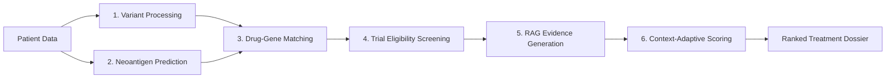

# RareCure 🧬

[](https://opensource.org/licenses/MIT)
[](https://www.python.org/downloads/release/python-3120/)
[](#contributing)

**An Open-Source AI Pipeline for Context-Adaptive Treatment Discovery in Rare Solid Tumors.**

RareCure is an automated, end-to-end pipeline designed to generate evidence-ranked therapeutic option dossiers for patients with rare cancers (e.g., soft tissue sarcomas). By integrating multi-database drug matching, ontology-aware clinical trial expansion, and context-adaptive AI scoring, RareCure identifies clinically actionable options at a fraction of the cost and time of traditional genomic interpretation services.

> **⚠️ CLINICAL DISCLAIMER:** RareCure is intended for **research purposes only**. It is not designed, validated, or approved for clinical use, diagnosis, or the treatment of any medical condition. It is not a regulated medical device. All outputs should be independently reviewed by qualified healthcare professionals.

---

## 🚀 Key Features

* **End-to-End Integration:** Unifies somatic variant processing, neoantigen prediction, drug-gene matching, and clinical trial screening into a single automated workflow.
* **Ontology-Aware Trial Matching:** Overcomes the "rare disease search gap" by expanding queries through a cancer-type hierarchy (e.g., *Myxofibrosarcoma → Soft Tissue Sarcoma → Solid Tumor*) to surface relevant basket and tumor-agnostic trials.
* **Context-Adaptive Scoring via Deterministic Clamping:** Uses LLMs to dynamically weight treatment options based on patient acuity, safeguarded by deterministic clinical bounds to ensure auditable, reproducible results.
* **Dual Deployment Architecture:**
  * **Research Mode:** Connects to cloud-hosted LLMs (e.g., Claude 3.5 Sonnet) for high-performance analysis of de-identified public data.
  * **Clinical Mode:** Supports locally-hosted, open-source models (e.g., Llama 3.1) for fully offline operation in PHI-protected, air-gapped environments.

---

## 🧠 System Architecture

RareCure processes patient data through six specialized modules. It supports **Mode A** (Genomic input via MAF/VCF) and **Mode B** (Clinical-only fallback utilizing curated subtype guidelines).



---

## 🛠️ Installation & Setup

### Prerequisites
* Python 3.12+
* An API key for your chosen LLM provider (if using Research Mode).

### 1. Clone the Repository
```bash
git clone https://github.com/DanielMartin-Arogyasami/RareCure.git
cd RareCure
```

### 2. Set Up a Virtual Environment
It is highly recommended to use an isolated environment.
```bash
python3 -m venv venv
source venv/bin/activate  # On Windows use: venv\Scripts\activate
```

### 3. Install Dependencies
```bash
pip install -r requirements.txt
```

### 4. Configuration
Set your environment variables. For cloud-based research execution, export your Anthropic API key:
```bash
export ANTHROPIC_API_KEY="sk-your-api-key-here"
```
*(Note: To run in Clinical Mode with a local LLM, refer to the `docs/LOCAL_LLM_SETUP.md` guide to configure your local inference endpoint).*

---

## 💻 Usage

You can run individual modules for targeted analysis or execute the full orchestration pipeline.

### Running the Full Pipeline
Execute the complete end-to-end orchestration agent using a structured JSON patient profile:
```bash
python -m rarecure.pipeline --patient-json data/sample/patient_f.json
```

### Running Individual Modules
To test or utilize specific components independently:
```bash
# Run drug-gene interaction matching
python -m rarecure.drug_match --variants data/sample/variants.vcf

# Run ontology-aware clinical trial matching
python -m rarecure.trial_match --subtype "spindle cell sarcoma"

# Run context-adaptive scoring
python -m rarecure.scoring --dossier data/sample/raw_dossier.json
```

---

## 🧪 Testing

RareCure uses `pytest` for unit and integration testing. To run the standard test suite (excluding long-running external API integrations):

```bash
pytest tests/ -v -m "not integration"
```

To run the adversarial clamping tests specifically:
```bash
pytest tests/test_clamping.py -v
```

---

## 📊 Validation & Performance

In a retrospective validation on 260 soft tissue sarcoma patients from The Cancer Genome Atlas (TCGA-SARC):
* **Actionable Matches:** Identified at least one Tier 1 or Tier 2 drug match in **30.0%** of patients.
* **Biomarker Precision:** Achieved biomarker-driven matching from patient-specific somatic mutations in **78.8%** of cases.
* **Compute Efficiency:** Total compute API cost averaged **$1.17 per patient**.
* **Safety:** The deterministic weight clamping mechanism triggered reliably during adversarial testing, correcting extreme LLM weight distributions and maintaining clinical guardrails.

---

## 📝 Citation

If you use RareCure in your research, please cite the foundational paper:

```bibtex
@article{Arogyasami2026RareCure,
  title={RareCure: An Open-Source AI Pipeline for Context-Adaptive Treatment Discovery in Rare Solid Tumors},
  author={Arogyasami, DanielMartin},
  journal={bioRxiv},
  year={2026},
  publisher={Cold Spring Harbor Laboratory}
}
```

## 📄 License

This project is licensed under the MIT License - see the [LICENSE](LICENSE) file for details.
