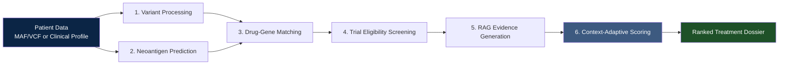

<div align="center">

# 🧬 RareCure

### An Open-Source AI Pipeline for Context-Adaptive Treatment Discovery in Rare Solid Tumors

*From somatic variants to an evidence-ranked therapeutic option dossier — in a single automated pass, at $1.17 per patient.*

[](https://opensource.org/licenses/MIT)
[](https://www.python.org/downloads/release/python-3120/)
[](https://doi.org/10.5281/zenodo.20386438)
[-red.svg)](#-citation)
[](https://github.com/psf/black)
[](#-contributing)

</div>

---

> [!WARNING]
> **RareCure is a research prototype intended for research purposes only.** It is **not** designed, validated, or approved for clinical use, diagnosis, or treatment of any medical condition. It is **not** CLIA-certified and **not** a regulated medical device. All outputs must be independently reviewed by qualified healthcare professionals.

---

## ✨ At a Glance

<div align="center">

| | |
|---|---|
| 🎯 **Validation cohort** | 260 soft tissue sarcoma patients (TCGA-SARC) |
| 🧪 **Tier 1/2 actionability** | **30.0%** of patients <br/> *(95% CI: 24.5–36.0%, concordant with published 20–40% sarcoma genomic profiling range)* |
| 🧬 **Biomarker-driven match rate** | **78.8%** (205/260) |
| 💰 **Interpretation cost** | **$1.17 / patient** (cloud LLM) · **$0** (local LLM mode) |
| 🔌 **Knowledge sources integrated** | DGIdb · CIViC · OncoKB · ChEMBL · ClinicalTrials.gov · PubMed |
| ⚖️ **Sarcoma subtypes in ontology** | 11 + default fallback |

</div>

---

## 📚 Table of Contents

- [Why RareCure?](#-why-rarecure)
- [How It Works](#-how-it-works)
- [The Six Modules](#-the-six-modules)
- [Comparison to Existing Tools](#-comparison-to-existing-tools)
- [Results](#-results)
- [Quick Start](#-quick-start)
- [Installation](#-installation)
- [Usage](#-usage)
- [Output Schema](#-output-schema)
- [Deployment Modes](#-deployment-modes)
- [Reproducibility](#-reproducibility)
- [Project Structure](#-project-structure)
- [Roadmap](#-roadmap)
- [Citation](#-citation)
- [Contributing](#-contributing)
- [FAQ](#-faq)
- [License & Acknowledgments](#-license)

---

## 💡 Why RareCure?

Rare cancers account for **25–30%** of US cancer diagnoses, yet precision-oncology infrastructure has been built for the common ones. Soft tissue sarcomas exemplify the gap: **>50 histological subtypes**, fewer than 5% with dedicated trials, and five-year metastatic survival stuck below 20% for decades.

Today, when standard options run out, a patient's oncologist must manually cross-reference at least four disconnected resources — **OncoKB** for variant annotation, **DGIdb** for drug–gene relationships, **ClinicalTrials.gov** for trial eligibility, and **PubMed** for evidence — and synthesize the result by hand. This rarely happens systematically in community settings. It's a fundamentally manual workflow blocking a fundamentally automatable problem.

**RareCure closes that loop.** A user submits either a somatic variant file (MAF/VCF, with optional HLA typing) or a structured clinical profile. The pipeline annotates variants, queries four drug–gene databases in parallel, performs ontology-aware searches of ClinicalTrials.gov that surface basket trials invisible to direct rare-subtype searches, retrieves grounding literature from an indexed PubMed corpus, and synthesizes everything into an **evidence-ranked dossier** with regulatory access pathway annotations — for clinician review.

---

## 🧠 How It Works


```mermaid
graph LR
    A[Patient Data<br/>MAF/VCF or Clinical Profile] --> B[1. Variant Processing]
    A --> C[2. Neoantigen Prediction]
    B --> D[3. Drug-Gene Matching]
    C --> D
    D --> E[4. Trial Eligibility Screening]
    E --> F[5. RAG Evidence Generation]
    F --> G[6. Context-Adaptive Scoring]
    G --> H[Ranked Treatment Dossier]

    style A fill:#0B2545,color:#fff
    style H fill:#1E5128,color:#fff
    style G fill:#3D5A80,color:#fff
```

Two architectural ideas distinguish RareCure from earlier point tools:

1. **Ontology-aware trial matching.** Rare-subtype queries are progressively broadened through a cancer-type hierarchy
   *(e.g. `Myxofibrosarcoma → Soft Tissue Sarcoma → Sarcoma → Solid Tumor`)*,
   surfacing basket and tumor-agnostic studies invisible to direct keyword searches.

2. **Deterministic weight clamping for LLM scoring.** An LLM dynamically generates scoring weights based on patient acuity, but every weight is **clamped within clinically-defined bounds** (e.g. evidence strength ∈ [0.05, 0.60]; safety ∈ [0.03, 0.40]) before composite scoring — adaptive reasoning *inside* auditable, version-controlled limits. A design pattern usable beyond oncology.

---

## 🧩 The Six Modules

| # | Module | What it does | Backing sources |
|---|---|---|---|
| **1** | Variant Processing | Parses MAF/VCF (chunked, multi-GB safe), filters to coding variants, classifies into 4 evidence tiers | OncoKB, CIViC, COSMIC, SIFT, PolyPhen-2 |
| **2** | Neoantigen Prediction | Dual-resolution: patient-specific HLA (Mode A) or 7 high-frequency supertypes (Mode B) | pVACtools, NetMHCpan-4.1, MHCflurry 2.0 |
| **3** | Drug–Gene Matching | Concurrent multi-source querying (4 DBs), tier-harmonized results, conflict audit log | DGIdb, CIViC, OncoKB, ChEMBL |
| **4** | Trial Matching | Ontology-aware query expansion across 4 hierarchy levels, dispatched concurrently | ClinicalTrials.gov REST API v2 |
| **5** | RAG Evidence Generation | 512-token PubMed chunks, embedded with `all-MiniLM-L6-v2`, retrieved via ChromaDB (cosine ≥ 0.65), PMID-grounded | NCBI FTP baseline, ChromaDB |
| **6** | Context-Adaptive Orchestration | ReAct-style LLM orchestration · median-of-5 weight generation · **deterministic clamping** · novelty bonus | Claude 3.5 Sonnet (cloud) or Llama 3.1-70B (local) |

---

## 🔬 Comparison to Existing Tools

| Capability | OncoKB | DGIdb | pVACtools | ClinicalTrials.gov | **RareCure** |
|---|:---:|:---:|:---:|:---:|:---:|
| Variant annotation | ✅ | ❌ | ❌ | ❌ | ✅ |
| Drug–gene matching | partial | ✅ | ❌ | ❌ | ✅ (4 sources, harmonized) |
| Neoantigen prediction | ❌ | ❌ | ✅ | ❌ | ✅ |
| Trial discovery for rare subtypes | ❌ | ❌ | ❌ | direct keyword only | ✅ (ontology-aware) |
| Literature evidence retrieval | ❌ | ❌ | ❌ | ❌ | ✅ (RAG, PMID-grounded) |
| Context-adaptive ranking | ❌ | ❌ | ❌ | ❌ | ✅ (clamped LLM weights) |
| End-to-end automation | ❌ | ❌ | ❌ | ❌ | ✅ |
| Air-gapped / local-LLM deployment | n/a | n/a | n/a | n/a | ✅ |
| Open-source (MIT) | partial | ✅ | ✅ | ✅ | ✅ |

> *Every existing resource solves a slice of the problem. RareCure is the first end-to-end open pipeline that produces a complete, evidence-ranked therapeutic dossier from a single input.*

---

## 📊 Results

Validated retrospectively on the **TCGA-SARC** cohort (N = 260).

### Top matched therapies (Tier 1/2)

| Therapeutic agent | Primary target | Patients matched |
|---|---|:---:|
| Palbociclib | CDK4/CDK6 | **38** |
| Larotrectinib | NTRK1/2/3 | 17 |
| Pazopanib | VEGFR/PDGFR/c-KIT | 15 |
| Selumetinib | MEK1/MEK2 | 3 |
| Olaparib | PARP1/PARP2 | 2 |
| Talazoparib | PARP1/PARP2 | 1 |
| Fluorouracil | Thymidylate synthase | 1 |
| Everolimus | mTOR | 1 |

The palbociclib peak is consistent with the high prevalence of CDK4 amplification in dedifferentiated liposarcoma.

### Headline numbers

- ✅ **End-to-end execution on 100%** of the 260-patient cohort
- ✅ **30.0%** reached Tier 1 or Tier 2 (immediately actionable)
- ✅ **78.8%** received biomarker-driven matches from patient-specific mutations
- ✅ **0.0%** clamping trigger rate on standard inputs; **100%** correct interception on a constructed boundary-condition test
- ✅ **$303.74** total LLM cost across the full cohort

> **Important caveat from the paper:** Partial overlap exists between TCGA-SARC and the evidence used to curate OncoKB's actionability classifications. The 30.0% rate should be interpreted as **consistent with published sarcoma benchmarks**, not as an independent performance estimate. External validation on AACR Project GENIE is on the [roadmap](#-roadmap).

---

## 🚀 Quick Start

The fastest way to try RareCure end-to-end on the bundled synthetic sample:

```bash
git clone https://github.com/DanielMartin-Arogyasami/RareCure.git
cd RareCure
pip install -r requirements.txt
export ANTHROPIC_API_KEY="sk-your-key-here"
python -m rarecure.pipeline --patient-json data/sample/patient_f.json
```

Prefer containers? Skip straight to the [Docker recipe](#docker).

---

## 🛠 Installation

### Prerequisites

- Python **3.12+**
- ~2 GB free disk space for cached PubMed and OncoKB extracts
- One of:
  - An **Anthropic API key** (Research Mode, recommended for de-identified public data), **or**
  - A local Llama-compatible inference endpoint (Clinical Mode, for PHI/HIPAA workloads)

### From source

```bash
# 1. Clone
git clone https://github.com/DanielMartin-Arogyasami/RareCure.git
cd RareCure

# 2. Isolated environment
python3.12 -m venv .venv
source .venv/bin/activate          # Windows: .venv\Scripts\activate

# 3. Install pinned dependencies
pip install -r requirements.txt

# 4. Configure
cp .env.example .env               # then edit .env with your credentials
```

### Docker

A reproducible image with all dependencies and pinned library versions:

```bash
docker pull ghcr.io/danielmartin-arogyasami/rarecure:latest
docker run --rm \
  -e ANTHROPIC_API_KEY=$ANTHROPIC_API_KEY \
  -v "$(pwd)/data:/workspace/data" \
  ghcr.io/danielmartin-arogyasami/rarecure:latest \
  python -m rarecure.pipeline --patient-json data/sample/patient_f.json
```

> Building from source instead? `docker build -t rarecure .`

---

## 💻 Usage

### Full pipeline

```bash
# Mode A: genomic input (MAF or VCF with optional HLA typing)
python -m rarecure.pipeline --maf data/sample/patient.maf --hla data/sample/hla.json

# Mode B: clinical-only profile (skips variant + neoantigen modules)
python -m rarecure.pipeline --patient-json data/sample/patient_f.json
```

### Individual modules

```bash
# Drug–gene matching only
python -m rarecure.drug_match --variants data/sample/variants.vcf

# Ontology-aware trial matching
python -m rarecure.trial_match --subtype "spindle cell sarcoma" --location "Indianapolis, IN"

# Context-adaptive scoring on a raw dossier
python -m rarecure.scoring --dossier data/sample/raw_dossier.json
```

### Python API

```python
from rarecure import Pipeline, PatientProfile

profile = PatientProfile(
    histology="dedifferentiated liposarcoma",
    stage="IV",
    prior_treatments=["doxorubicin", "ifosfamide"],
    biomarkers={"CDK4": "amplification", "MDM2": "amplification"},
)

pipeline = Pipeline(mode="research")     # or mode="clinical" for local LLM
dossier = pipeline.run(profile)

for option in dossier.options[:5]:
    print(f"[{option.tier}] {option.therapy}  →  {option.composite_score:.2f}")
    print(f"    mechanism : {option.mechanism}")
    print(f"    access    : {option.regulatory_pathway}")
    print(f"    evidence  : {option.pmids}")
```

---

## 📋 Output Schema

Every option in the dossier carries:

```jsonc
{
  "therapy": "Palbociclib",
  "mechanism": "CDK4/CDK6 inhibitor",
  "tier": 2,                          // 1=known actionable ... 4=likely passenger
  "evidence_sources": ["OncoKB:3A", "CIViC:B", "DGIdb"],
  "trial_matches": [
    { "nct_id": "NCT0...", "phase": "II", "match_level": "sarcoma" }
  ],
  "literature": [
    { "pmid": "31...", "title": "...", "year": 2024 }
  ],
  "regulatory_pathway": "off-label with NCCN compendium support",
  "weights": {                        // produced by Module 6, post-clamping
    "evidence_strength": 0.42,
    "access_feasibility": 0.18,
    "expected_response": 0.22,
    "safety_profile":   0.10,
    "cost":             0.08
  },
  "clamped": false,                   // audit flag
  "composite_score": 0.83,
  "next_step_action": "Discuss in molecular tumor board"
}
```

---

## 🔀 Deployment Modes

|  | **Research Mode** | **Clinical Mode** |
|---|---|---|
| Intended data | De-identified / public (e.g. TCGA) | PHI under HIPAA, GDPR, or equivalent |
| LLM endpoint | Cloud API (Claude 3.5 Sonnet) | Local open-source (e.g. Llama 3.1-70B) |
| Data leaves environment? | Only de-identified content | **No.** Fully air-gapped possible |
| Setup | `ANTHROPIC_API_KEY` env var | Local inference server + endpoint config |
| Cost | ~$1.17 / patient | $0 incremental (institutional compute) |
| Pipeline logic | **Identical** | **Identical** |

> Module logic, interfaces, and scoring methodology are byte-identical across modes — only the `LLM_PROVIDER` environment variable differs. Deterministic clamping operates independently of the LLM provider.

---

## 🔁 Reproducibility

Reproducibility is a first-class concern:

- **Pinned dependencies** in `requirements.txt` (exact versions, including `pVACtools`, `chromadb`, `httpx`, `sentence-transformers`, `scipy`)
- **Pinned Docker image** with the same versions baked in
- **Synthetic test data** committed under `data/sample/` — no PHI, no licensing restrictions
- **PubMed corpus** built from NCBI FTP baseline (January 2026 release) for offline operation
- **Deterministic clamping bounds** exposed as version-controlled YAML parameters
- **Audit artifacts**: ReAct reasoning traces, tool invocations, intermediate observations, and weight-clamping booleans persisted to disk for every run
- **Statistical analysis** performed with Clopper–Pearson 95% CIs (SciPy, threshold α = 0.05)

To exactly reproduce the manuscript's TCGA-SARC analysis:

```bash
python -m rarecure.experiments.reproduce_tcga_sarc --output ./reproduction
```

---

## 📁 Project Structure

```
RareCure/
├── rarecure/
│   ├── pipeline.py                # End-to-end orchestrator (Module 6 entry)
│   ├── variant_processing.py      # Module 1
│   ├── neoantigen.py              # Module 2
│   ├── drug_match.py              # Module 3
│   ├── trial_match.py             # Module 4 + ontology expansion
│   ├── rag.py                     # Module 5
│   ├── scoring.py                 # Context-adaptive scoring + clamping
│   ├── config/
│   │   ├── clamping_bounds.yaml   # Tunable per-institution
│   │   └── cancer_ontology.yaml   # 11 subtypes + fallback hierarchy
│   └── experiments/
│       └── reproduce_tcga_sarc.py
├── data/
│   └── sample/                    # Synthetic test cases (no PHI)
├── docs/
│   ├── ARCHITECTURE.md
│   ├── LOCAL_LLM_SETUP.md
│   └── prompt_template.md         # Full Module 6 prompt
├── tests/                         # Pytest suite (unit + integration)
├── Dockerfile
├── requirements.txt
├── LICENSE
└── README.md
```

---

## 🗺 Roadmap

The published manuscript's "future work" is this project's active backlog:

- [ ] **Module-level ablation** isolating the marginal contribution of ontology expansion, multi-DB harmonization, and context-adaptive scoring
- [ ] **External validation** on the AACR Project GENIE sarcoma subset (eliminates TCGA/OncoKB circularity)
- [ ] **Batch-scale neoantigen validation** against experimental immunopeptidomics
- [ ] **Combination therapy modeling** (drug–drug interactions, overlapping toxicities)
- [ ] **Cross-model equivalence testing** across Claude, GPT-4, Llama, and Mistral
- [ ] **Structured perturbation suite** for systematic clamping evaluation
- [ ] **Formal Delphi-panel derivation** of scoring weights and clamping bounds
- [ ] **Expansion** to additional rare cancer types beyond sarcoma
- [ ] **Prospective molecular tumor board comparison** study

Contributions welcome on any of these — see [Contributing](#-contributing).

---

## 📝 Citation

If you use RareCure or the deterministic-clamping design pattern in your work, please cite:

> Arogyasami DM. *RareCure: An Open-Source Artificial Intelligence Pipeline for Context-Adaptive Treatment Discovery in Rare Solid Tumors.* Zenodo, 2026. doi:10.5281/zenodo.20386438

> *The peer-reviewed manuscript is in press at* Cureus *and the citation will be updated upon publication.*

<details>
<summary><b>BibTeX</b></summary>

```bibtex
@software{Arogyasami_RareCure_2026,
  author    = {Arogyasami, DanielMartin},
  title     = {RareCure: An Open-Source Artificial Intelligence Pipeline for
               Context-Adaptive Treatment Discovery in Rare Solid Tumors},
  month     = may,
  year      = 2026,
  publisher = {Zenodo},
  doi       = {10.5281/zenodo.20386438},
  url       = {https://doi.org/10.5281/zenodo.20386438}
}
```

</details>

---

## 🤝 Contributing

Contributions of every size are welcome — issues, doc fixes, new sarcoma subtypes for the ontology, integrations with additional databases, ablation experiments, or wholly new modules.

1. Fork the repo and create a branch from `main`
2. Run the test suite: `pytest -q`
3. Format with `black .` and lint with `ruff check .`
4. Open a PR describing what changed and *why* — link to issues where relevant
5. For methodological changes (ontology, clamping bounds, scoring), please include a short rationale and any validation artifacts

If you're tackling a roadmap item, consider opening a tracking issue first to coordinate.

---

## ❓ FAQ

<details>
<summary><b>Can RareCure tell my doctor what to prescribe?</b></summary>

No. RareCure produces an *investigational option dossier* for review by a qualified clinician. It is not a regulated medical device, not CLIA-certified, and explicitly not designed for direct clinical use.
</details>

<details>
<summary><b>Why is the actionability rate "only" 30%?</b></summary>

That number reflects patients who reached **Tier 1 or Tier 2** — the most immediately actionable evidence levels. The remaining 70% still receive output (Tier 3/4 matches plus clinical trial eligibility surfaced through ontology expansion). The 30% figure is concordant with the 20–40% range reported across independent sarcoma genomic profiling studies.
</details>

<details>
<summary><b>Can I run RareCure without sending data to a cloud LLM?</b></summary>

Yes. Clinical Mode connects to a locally-hosted open-source model (e.g. Llama 3.1-70B) running entirely within your institution's network. No patient data leaves the local environment. See [`docs/LOCAL_LLM_SETUP.md`](docs/LOCAL_LLM_SETUP.md).
</details>

<details>
<summary><b>Is this just sarcoma, or other rare cancers too?</b></summary>

The current ontology and validation cohort are sarcoma-focused (TCGA-SARC). The architecture is cancer-agnostic, and expanding to additional rare cancer types is an active roadmap item. PRs welcome.
</details>

<details>
<summary><b>What happens if the LLM produces a degenerate weight distribution?</b></summary>

Deterministic clamping intercepts it. Each weight is constrained to a clinically-informed range (e.g. safety ∈ [0.03, 0.40]). A boundary-condition test in the paper confirmed correct interception when the LLM was instructed to set safety = 1.0 and zero out everything else — the clamp pulled safety back to 0.40 and redistributed weight within bounds. Every clamped run is tagged in the audit log.
</details>

<details>
<summary><b>How is this different from Foundation Medicine or Tempus?</b></summary>

Those are end-to-end commercial services that include DNA sequencing, CLIA-certified lab processing, and board-certified pathologist sign-off. RareCure does **not** sequence DNA and is **not** CLIA-certified. It is a complementary, open-source, post-sequencing *interpretation* and *option-screening* layer designed to be cheap enough to re-run as databases and trials update.
</details>

---

## 🙏 Acknowledgments

Built on the shoulders of giants. Sincere thanks to the maintainers of **pVACtools**, **DGIdb**, **CIViC**, **OncoKB**, **ChEMBL**, **NetMHCpan**, **MHCflurry**, **LlamaIndex**, **ChromaDB**, **sentence-transformers**, and **ClinicalTrials.gov**, and to **The Cancer Genome Atlas Research Network** for making the validation possible.

---

## 📄 License

This project is licensed under the **MIT License** — see [LICENSE](LICENSE) for the full text. Use it, fork it, ship it, adapt it. Attribution is appreciated.

---

<div align="center">

**Built with care for the rare cancer community.**

*If RareCure helps your research or a patient finds an option through it,*<br/>
*that's the whole point. Drop a line — I'd love to hear.*

</div>
